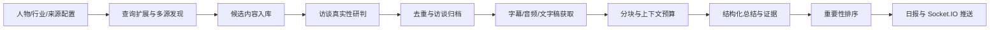
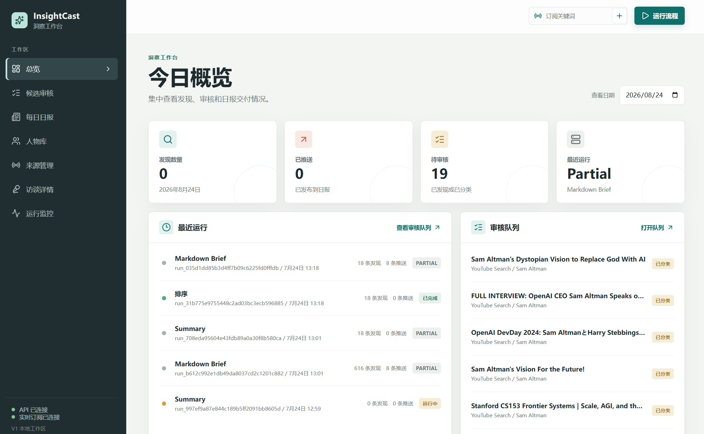
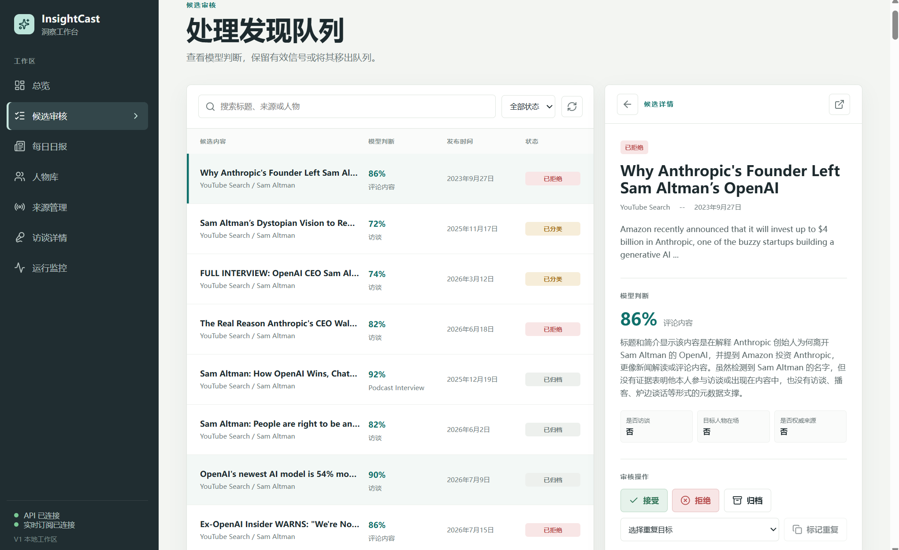
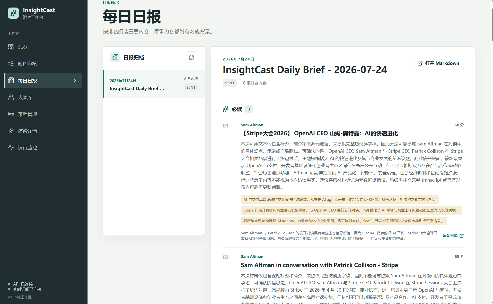
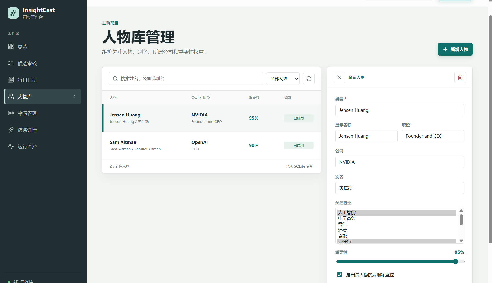
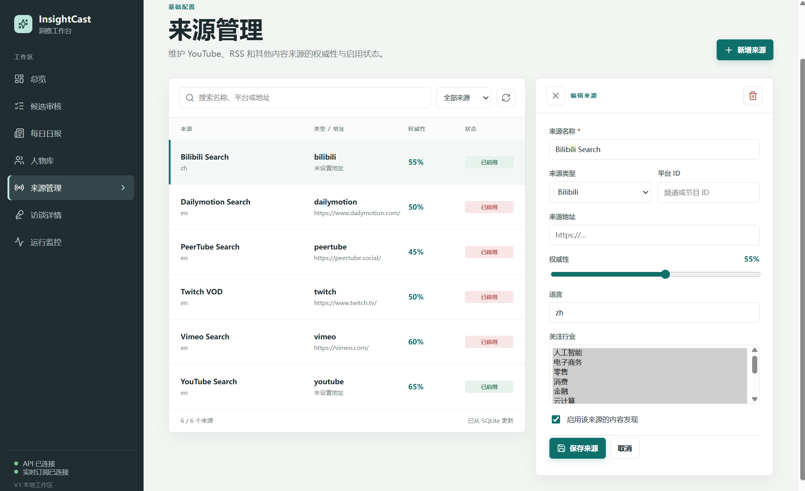
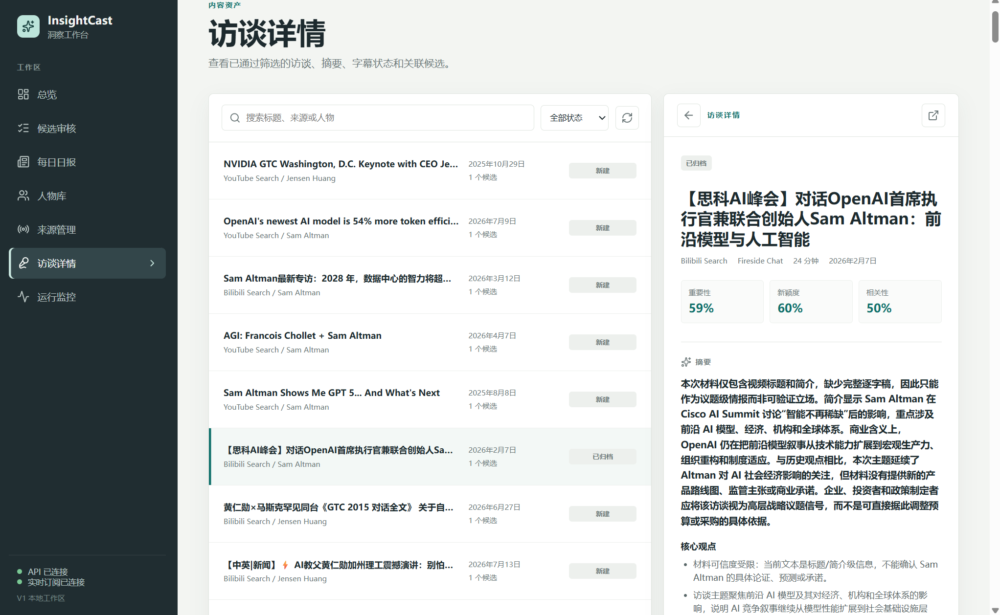
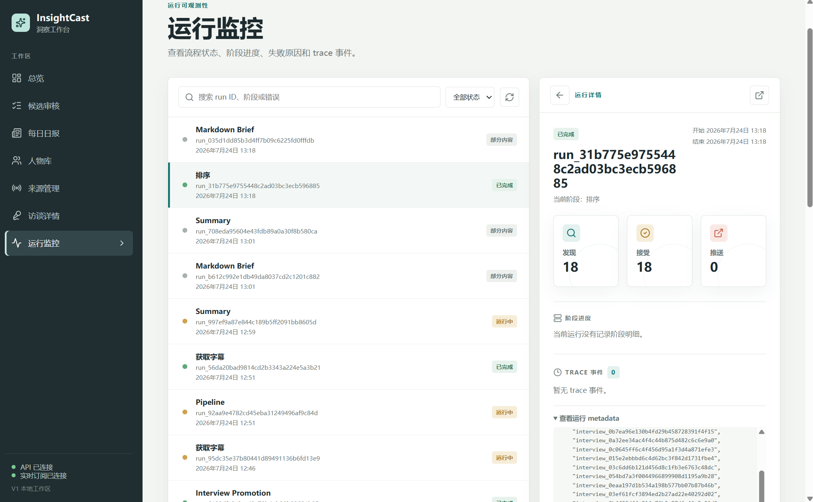

# InsightCast Harness

一个面向行业前沿访谈的智能资讯系统，以及支撑它运行的 Agent Harness。项目将多源内容发现、真实性研判、转录获取、结构化总结、重要性排序和实时推送串成一条可追踪的处理流水线，并通过 MCP / Agent Skill 接入 Cursor、GitHub Copilot 等 AI 工具。

这是一个个人研究与工程实践项目，重点探索长链路 Agent 的运行时管理、上下文控制、记忆、工具调用和可观测性。

## 项目组成

### InsightCast：行业动态监控 Agent

InsightCast 面向需要持续关注行业、公司和人物的用户，自动完成以下工作：

- 维护人物、行业、公司和来源配置；
- 为关注对象生成多语言扩展查询并进行多源发现；
- 判断候选内容是否为目标人物参与的真实访谈、播客、对话或演讲；
- 通过 URL 规范化、标题、人物、发布时间和内容指纹进行去重；
- 按“官方字幕 → 平台字幕 → 播客文字稿 → 媒体稿件 → 合规音频转录”获取内容；
- 对长文本进行分块、上下文压缩和结构化总结；
- 结合人物重要性、来源权威性、时效性和新观点等因素进行排序；
- 生成每日简报，并通过 Socket.IO 向订阅客户端实时推送；
- 通过 MCP 服务和 `insightcast-monitor` Agent Skill 对外提供监测能力。

核心处理链路如下：



### Harness：Agent 基础运行时

`Harness/` 提供 InsightCast 使用的通用 Agent 基础设施：

- **统一数据协议**：`Message`、`ToolCall`、`ToolResult`、`AgentState`、`RunEvent` 和 `RunResult`；
- **LLM 抽象层**：统一对话、流式和结构化输出接口，支持 Token 统计、重试、超时、Fallback 和多 Provider；
- **Runtime 与可观测性**：统一任务入口、`run_id` / `session_id`、事件记录、JSONL Trace、Checkpoint、Hook 和 Replay；
- **工具与集成**：工具注册、执行器、MCP 和 Skill 接入；
- **Agent Loop**：ReAct、Plan-and-Solve、Reflection；
- **上下文管理**：Token 预算、历史压缩、分块、裁剪和输出预留；
- **记忆系统**：短期、长期和语义记忆，以及多轮任务状态管理。

## 前端功能页面

InsightCast 提供一个 Vue 3 Web 控制台，用于查看处理结果、管理监控对象和跟踪流水线运行状态。

### 今日概览

集中查看当日发现数量、待审核候选、最近运行记录和审核队列。



### 候选审核

查看模型对候选内容的判断，并执行接受、拒绝、归档和重复标记等审核操作。



### 每日报

按重要性阅读结构化日报，查看摘要、关键观点、影响分析和原始来源。



### 人物库

维护需要持续追踪的人物、别名、所属公司、关注行业和重要性权重。



### 来源管理

配置 YouTube、Bilibili、Vimeo、Dailymotion、Twitch、PeerTube 等内容来源及其启用状态。



### 访谈详情

查看已归档访谈的来源信息、重要性评分、摘要、核心观点和关联候选。



### 运行监控

跟踪发现、分类、转录、总结和推送任务的运行状态、阶段进度与 Trace 事件。




## 技术栈

- **后端**：Python、FastAPI、Uvicorn、Python Socket.IO、SQLite；
- **Agent Runtime**：本仓库内的 Harness，支持 LLM、工具、上下文、记忆、Trace 和 Checkpoint；
- **前端**：Vue 3、TypeScript、Vite、Socket.IO Client；
- **模型接入**：OpenAI-compatible API，可接入 OpenRouter 或其他兼容服务；
- **数据源与内容处理**：YouTube API、yt-dlp、bili-cli、平台字幕和外部音频转写 MCP；
- **扩展协议**：MCP、Agent Skill。

## 目录结构

```text
.
├── Harness/
│   ├── src/                    # Agent 基础运行时
│   │   ├── context/            # 上下文构建、Token 预算、压缩与裁剪
│   │   ├── core/               # 消息、工具调用、状态与运行结果协议
│   │   ├── infra/              # 配置、异常、JSON、日志与序列化
│   │   ├── llm/                # LLM 抽象、Provider、重试与用量统计
│   │   ├── loops/              # ReAct、Plan-and-Solve 与 Reflection
│   │   ├── memory/             # 记忆存储、检索、过滤、融合与重排
│   │   ├── runtime/            # Runner、Checkpoint、Replay 与运行时 Hook
│   │   ├── tools/              # 工具注册、执行、重试、MCP 与 Skill
│   │   │   └── builtin/        # 内置工具
│   │   └── tracing/            # Trace 抽象与 JSONL 落盘
│   └── tests/                  # Harness 测试
├── InsightCast/
│   ├── backend/
│   │   ├── src/insightcast/    # 业务服务、Pipeline、API、MCP
│   │   │   ├── agent/             # 发现、分类、转录、总结、排序与简报 Agent
│   │   │   ├── api/               # FastAPI 接口、Schema、服务与实时通信
│   │   │   ├── briefs/             # Markdown 简报生成
│   │   │   ├── config/             # 环境变量与配置加载
│   │   │   ├── context/            # Trace 与 Transcript 上下文
│   │   │   ├── domain/             # 领域枚举与数据模型
│   │   │   ├── integrations/       # 外部平台集成
│   │   │   ├── mcp/                # MCP Server
│   │   │   ├── memory/             # 人物历史记忆
│   │   │   ├── run/                # 日常运行与发现运行入口
│   │   │   ├── scheduler/          # 定时任务
│   │   │   ├── sources/            # 查询生成、发现与候选入库
│   │   │   ├── storage/            # SQLite、JSON 与 Repository
│   │   │   ├── tools/              # 发现、Harness、Markdown 与 Transcript 工具
│   │   │   └── transcript/         # Transcript 获取与转录
│   │   ├── configs/            # 示例业务配置
│   │   ├── tests/              # 后端测试
│   │   └── requirements-api.txt
│   ├── frontend/               # Vue 3 Web 控制台
│   │   └── src/                 # 页面、API 客户端与实时订阅
│   │       ├── api.ts           # 后端 API 客户端
│   │       ├── realtime.ts      # Socket.IO 实时订阅
│   │       ├── types.ts         # 前端类型定义
│   │       ├── display.ts       # 展示辅助函数
│   │       ├── App.vue          # 应用入口
│   │       ├── InterviewsPage.vue
│   │       ├── PersonsPage.vue
│   │       ├── RunsPage.vue
│   │       ├── SourcesPage.vue
│   │       ├── main.ts
│   │       ├── styles.css
│   │       ├── shims-vue.d.ts
│   │       └── vite-env.d.ts
│   └── agent-skill/            # InsightCast Agent Skill 和宿主配置
└── README.md
```

## 本地启动

### 环境要求

- Python 3.10 或更高版本；
- Node.js 18 或更高版本；
- npm；
- 如需执行完整发现和总结流程，还需要配置相应的数据源和模型服务凭据。

### 启动后端

在仓库根目录打开 PowerShell：

```powershell
cd InsightCast\backend
python -m pip install -r requirements-api.txt
$env:PYTHONPATH="src;..\..\..\Harness\src"
python -m uvicorn insightcast.api.main:app --host 127.0.0.1 --port 8766
```

后端健康检查地址：<http://127.0.0.1:8766/health>

如果使用 Git Bash，可执行：

```bash
cd /d/Projects/Agent/InsightCastHarness/InsightCast/backend
python -m pip install -r requirements-api.txt
export PYTHONPATH="src;../../../Harness/src"
python -m uvicorn insightcast.api.main:app --host 127.0.0.1 --port 8766
```

### 启动前端

另开一个终端：

```bash
cd /d/Projects/Agent/InsightCastHarness/InsightCast/frontend
npm install
npm run dev
```

浏览器访问 <http://127.0.0.1:5173>。前端默认将 API 请求发送到 `http://127.0.0.1:8766`，也可以通过 `VITE_API_BASE_URL` 覆盖。

## 配置与安全

- `InsightCast/backend/configs/local.example.json` 提供本地种子配置；
- API Key、模型地址、Cookie 和其他本地环境变量应放在 `InsightCast/backend/.env` 或系统环境变量中；
- `.env`、`secrets/`、数据库、音频、Trace、Checkpoint 和运行日志已加入 `.gitignore`，不会作为公开仓库内容提交；
- 公开部署前应使用自己的凭据，并定期轮换 API Key 和平台 Cookie；
- 音频和字幕的获取、转录与使用应遵守对应平台的服务条款和版权要求。

MCP 与 Agent Skill 的配置示例位于 [`InsightCast/agent-skill/insightcast-monitor/`](./InsightCast/agent-skill/insightcast-monitor/)。

## 测试与构建

后端测试：

```bash
cd /d/Projects/Agent/InsightCastHarness/InsightCast/backend
python -m pytest
```

前端构建：

```bash
cd /d/Projects/Agent/InsightCastHarness/InsightCast/frontend
npm run build
```

InsightCast 是对上述 Agent 工程、检索、上下文管理和可观测性实践的综合项目化实现。
